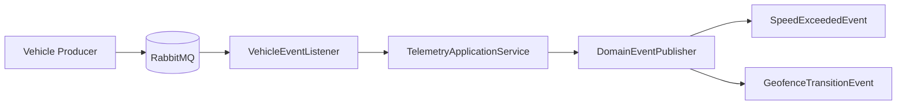
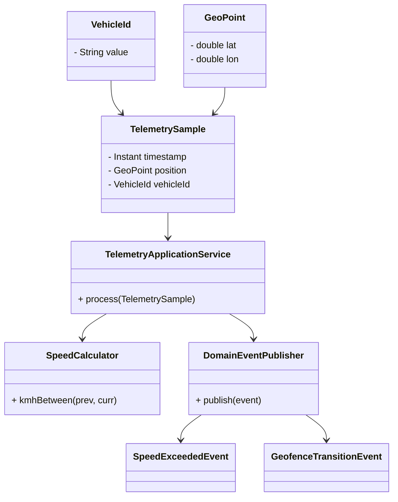
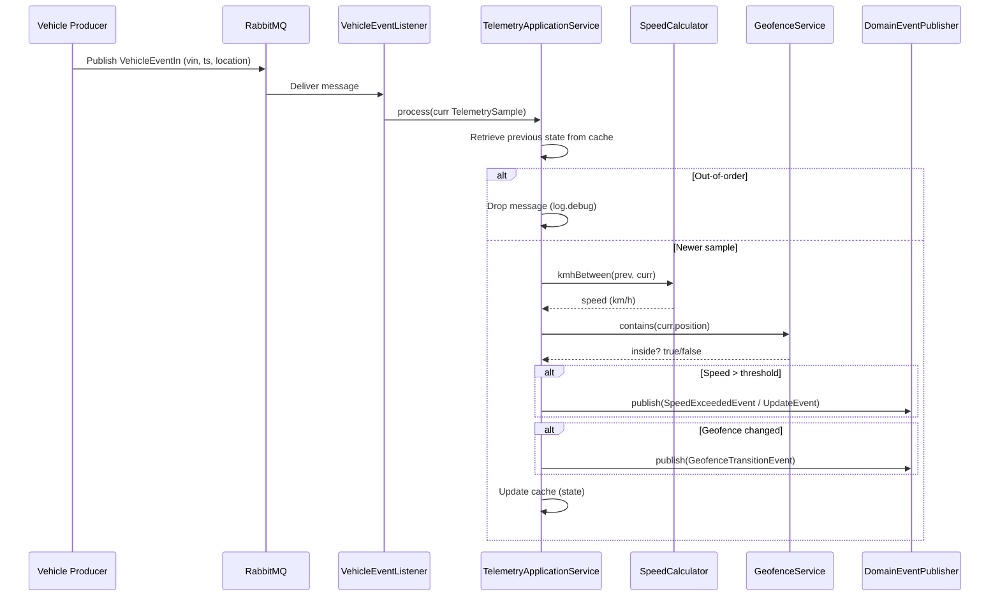

## Vehicle Consumer – Telemetry Processing Service

## Overview
This service consumes**vehicle telemetry events** from RabbitMQ, applies domain logic (speed threshold detection, geofence transitions), and publishes **domain events**.  
It follows a **Domain-Driven Design (DDD)** packaging and is built with **Spring Boot 3 / Java 17**.

---

## Features
- ✅ RabbitMQ consumer with `@RabbitListener`
- ✅ DDD domain model (Value Objects, Domain Events, Application Services)
- ✅ Speed threshold detection with configurable limit
- ✅ Geofence detection (polygon based)
- ✅ In-memory state management with Caffeine Cache
- ✅ Event publishing abstraction (`DomainEventPublisher`)
- ✅ Unit tests for core business logic
- ✅ Integration tests with RabbitMQ Testcontainers
- ✅ Production-ready Dockerfile & docker-compose

---

## Architecture & Decisions

### High-Level Flow





### Framework Usage
- Spring Boot auto-configuration: no manual `ConnectionFactory` required.
- `@ConfigurationProperties` (`AppRabbitProps`) for externalized queue/exchange/routing config.
- `@RabbitListener` for consuming messages, concurrency/prefetch tuned for efficiency.
- Caffeine Cache chosen for in-memory state (low-latency, bounded memory).

### DDD Structure
- **domain** → `TelemetrySample`, `VehicleId`, domain events
- **application** → `TelemetryApplicationService` (business orchestration)
- **infrastructure** → RabbitMQ configs, state store, mapping
- **messaging** → Listener consuming from RabbitMQ

### Performance & Maintainability
- In-memory cache avoids DB latency.
- Prefetch & concurrency tuned to balance throughput vs fairness.
- Domain logic isolated in services for maintainability.
- `DomainEventPublisher` abstraction allows future Kafka/REST publisher.
 
---

## 🧪 Testing Strategy

### Unit Tests
- `SpeedCalculatorTest`: haversine formula, Δt edge cases
- `TelemetryApplicationServiceTest`: threshold crossing, geofence transitions, state updates, out-of-order handling
- `VehicleIdTest`, `VehicleEventMapperTest`: VO & mapping correctness

### Integration Tests
- `TelemetryIntegrationIT` with RabbitMQ Testcontainers
- Verifies JSON → Domain → Event pipeline end-to-end
- Uses Awaitility for async assertions

---

## Dependencies

**Runtime**
- Spring Boot 3.x
- Spring AMQP
- Caffeine Cache
- Jackson

**Test**
- JUnit 5
- Mockito
- Testcontainers (RabbitMQ)
- Awaitility

---

## Future Improvements
-  `Retry / DLQ handling `
-  `Persist state in Redis for HA `
-  `Structured logging (ELK/Grafana) `
-  `Metrics with Micrometer & Prometheus `
-  `CI/CD pipeline integration `


## ▶️ Running Locally

### With Docker Compose
```bash
docker-compose up --build
```

### Or run RabbitMQ manually:

```bash
docker run -p 5672:5672 rabbitmq:3.13
./mvnw spring-boot:run
```

### 🔨 Build & Test
```bash
./mvnw clean verify
```

### Skip integration tests (no Docker available)
```bash
./mvnw clean verify -DskipITs
```

## ❗ Assumptions & Production Considerations

- Although the code is production-ready in its current state, there are some concerns and areas to monitor in a real deployment:

- Message Delivery Semantics → Currently using auto-ack. For at-least-once or exactly-once guarantees, DLQ and retry policy should be added.

- State Storage → In-memory Caffeine cache works for single-instance deployments. For HA or multi-instance scaling, Redis or another distributed cache is required.

- Geofence Accuracy → Point-in-polygon implementation is simplified. Edge cases (point on boundary, complex polygons) may need stricter handling.

- Observability → Currently only logging. Production would require metrics (Micrometer), tracing, and structured logs.

- Configuration Management → Properties are externalized via YAML. Consider using a central config service (e.g., Spring Cloud Config, Vault) in production.

- Security → No auth/SSL configured for RabbitMQ. TLS and proper credentials management should be ensured in production.

- Scalability → Concurrency is tuned for small loads. Horizontal scaling of consumers may require sharding or keyed executors to avoid race conditions per VIN.